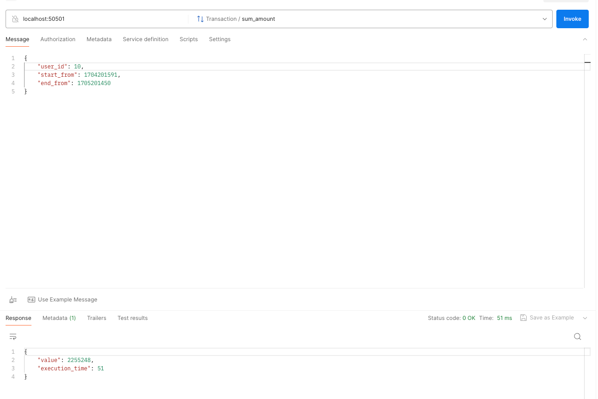

# Тестовое задание в компанию _"ООО БУЛАТ"_

## Задание

Задание пока что не прикрепляю, чтобы случайно не распространить решение.

## Реализовано

- [x] gRPC-приложение
- [x] Миграции для базы данных
- [x] Тестирование
- [x] Линтер
- [x] Сборка приложения в контейнеры

## Запуск

```shell 
docker compose --project-name test --file deployment/docker-compose.yaml up
```

### Переменные окружения

|    Переменная    | Обязательная | Описание                           | Значение по умолчанию |
|:----------------:|:------------:|------------------------------------|-----------------------|
|     DB_USER      |      Да      | Пользователь для подключения к БД. | `test`                |
|   DB_PASSWORD    |      Да      | Пароль для подключения к БД.       | `test`                |
|     DB_HOST      |      Да      | Хост для подключения к БД.         | `localhost`           |
|     DB_PORT      |      Да      | Порт для подключения к БД.         | `6432`                |
|   DB_DATABASE    |      Да      | Название БД для подключения к БД.  | `postgres`            |
| APPLICATION_HOST |     Нет      | Хост приложения.                   | `0.0.0.0`             |
| APPLICATION_PORT |     Нет      | Порт приложения.                   | `50501`               |

## Увеличение скорости работы приложения

Чтобы запросы выполнялись быстро

- В базу данных добавлен индекс на атрибуты user_id и timestamp;
- Используется пул подключений к базе данных;

## Миграции

Мне не хотелось иметь зависимость от SQLAlchemy и Alembic, поэтому миграции написаны и применяются вручную.
После того как база данных поднялась, требуется применить миграции:

1. [1_create_transaction_table.sql](migrations%2Fadd_transaction_table.sql)
2. [2_populate_transaction_table.sql](migrations%2F2_populate_transaction_table.sql)

## Тестирование

> **Для корректного запуска тестов требуется установленный Docker.**

Установка зависимостей для тестирования:

```shell
pip install -r requirements-test.txt
```

Для запуска тестов требуется в корневой директории проекта выполнить команду:

```shell 
python -m pytest
```

## Линтер

В качестве линтера используется [Ruff](https://docs.astral.sh/ruff/).
Настройка правил производится в [pyproject.toml](pyproject.toml).
Подробнее про настройки правил можно прочитать в [документации Ruff](https://docs.astral.sh/ruff/configuration/).

Для проверки кода требуется в корневой директории проекта выполнить команду:

```shell 
ruff check .
```

## Корректно выполненный запрос

